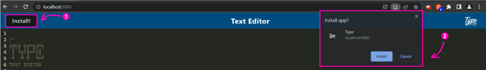

## Progressive Web Applications (PWA) : Text Editor
     


<p align="center">
  
</p>
<br />
<br />

## Description

**Type | Text Editor, is also just another text editor. It's a single-page application that features the requirements of Progressive Web Applications(PWAs). It includes a method to store and retrieve data using the IndexedDB database**


[Deployed Link: using Heroku](https://type-te.herokuapp.com/)
<br />
<br />

## User Story (Big Idea) 
A simple app that lets you create notes or code snippets using your local browser and be able to install it on your local machine.
<br />
<br />

## Application Audit Results: Lighthouse
- metric values estimated may vary
<p align="left">
  
</p>
<br />
<br />

## Table of Contents
1. [Demo](#demo)
    1. [How to install the app](#how-to-install-the-app)
    2. [Overview of the app after installation](#overview-of-the-app-after-installation)
    3. [Webpack bundle folder structure](#webpack-bundle-folder-structure)

2. [Future development](#future-development)
3. [Feedback or Contribute](#feedback-or-contribute)
4. [License](#license)
5. [Reference](#reference)


## Demo
```
- Preview of the app for installation
- It generates a manifest.json including the bundles built using the webpack plugin
```
<br />

#### How to install the app

- **click the install button**

<br />

- **check whether your app installed on your local machine**

<br />
<br />

#### Overview of the app after installation


<br />
<br />

#### Webpack bundle folder structure
```
/
└── client                        // (root)
    ├── dist                      // (generated files using npm run build)
      ├── assets                  // (generated icons)  
      ├── index.html              // (generated html)  
      ├── js files & text         // (generated bundled files)  
      ├── manifest.json           // (metadata of the web app) 
      ├── src-sw.js               // (generated service worker file) 
```
<br />
<br />

## Future development

<details>
<summary>Add toggle buttons</summary>
</details>

<details>
<summary>Web accessiblility</summary>
</details>
<br />
<br />

## Feedback or Contribute
***If you have any feedback or suggestion feel free to send an email,*** codingowl898@gmail.com

## License
All rights reserved. Under the MIT license.

## Reference

<details>
<summary>For documentation</summary>

[Workbox-Build](https://developer.chrome.com/docs/workbox/reference/workbox-build/) and [Webpack](https://webpack.js.org/concepts/documentation) 

</details>

<details>
<summary>For web application audit tool</summary>

[Lighthouse](https://chrome.google.com/webstore/detail/lighthouse/blipmdconlkpinefehnmjammfjpmpbjk?hl=en)

</details>